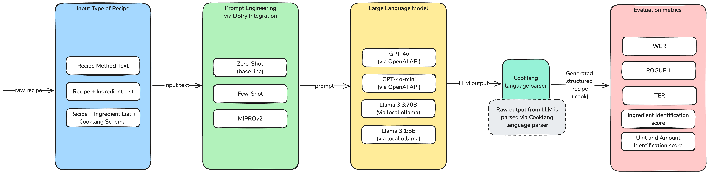

# Project
Evaluating Large Language Models for Recipe Conversion. Code repository for the research project - **The Effectiveness of Large Language Models in Transforming Unstructured Text to Standardized Formats.**



## Results

### Results by model


### Results by prompt technique


## Prompt examples


### Example of prompt (Few-Shot) for Cooklang conversion without cooklang notation and with ingredients

```bash
Convert plain recipe text with provided ingredients into Cooklang text format.
Return only Cooklang formatted recipe, dont return any other information. Return whole recipe in Cooklang format! Dont stop till you reach the end of the recipe.

---

Ingredients: 50 g ciabatta,some oil,,50 g cottage cheese,80 g smoked salmon,5 g capers,1 g dill,some lemon,some black pepper
Recipe Text: Slice the whole ciabatta loaf in half and then slice the halves lengthwise. Fry the ciabatta halves in a frying pan in a little oil, a griddle pan gives the best results and makes nice lines as the bread toasts. Spread the cottage cheese on the toasted ciabatta liberally, cut out the smoked salmon slices and place on the bread with a sprinkling of capers and finally chopped dill. Serve with a lemon wedge and freshly cracked black pepper.
Cooklang: Slice the whole @ciabatta{50%g} loaf in half and then slice the halves lengthwise. Fry the ciabatta halves in a #frying pan{} in a little @oil, a griddle pan gives the best results and makes nice lines as the bread toasts. Spread the @cottage cheese{50%g} on the toasted ciabatta liberally, cut out the @smoked salmon{80%g} slices and place on the bread with a sprinkling of @capers{5%g} and finally chopped @dill{1%g}. Serve with a @lemon wedge and freshly cracked @black pepper{}.

[Additional examples omitted for brevity]

---

Follow the following format.

Ingredients: Ingredients for the recipe. Comma separated list of ingredients.

Recipe Text: Recipe text to convert to Cooklang format.

Reasoning: Let's think step by step in order to ${produce the cooklang}. We ...

Cooklang: Cooklang formatted recipe.

---

Ingredients: {ingredients}

Recipe Text: {recipe text}

Reasoning: Let's think step by step in order to Cooklang:
```

### Example of prompt (MIPROv2) for Cooklang conversion with cooklang notation and with ingredients

```bash
Transform the given plain text recipe and accompanying ingredients into a structured Cooklang format. Use the following specifications:

1. **Ingredients:**
   - Prefix each ingredient with `@`.
   - For multi-word ingredients, wrap the entire ingredient in `{}`.
   - Indicate the quantity directly after the ingredient name in `{}`, followed by a `%` for the unit.
   - Example: `@salt`, `@ground black pepper{}`, `@potato{2}`, `@bacon strips{1%kg}`, `@syrup{1/2%tbsp}`.

2. **Comments:**
   - Use `--` to denote single-line comments.
   - For multi-line comments, enclose them in `[- -]`.
   - Example: `-- Don't burn the roux!`.

3. **Cookware:**
   - Use `#` to specify the cookware required.
   - For multi-word items, enclose in `{}`.
   - Example: `#pot`, `#potato masher{}`.

4. **Timers:**
   - Use `~` to specify timing instructions.
   - Indicate the duration in `{}`.
   - You may include a name before the duration.
   - Example: `~{25%minutes}`, `~eggs{3%minutes}`.

Return only the Cooklang formatted recipe without any additional commentary or information. Ensure that the output is complete and captures all elements of the recipe succinctly.

---

[Few-shot examples omitted for brevity]

---

Follow the following format.

Ingredients: Ingredients for the recipe. Comma-separated list of ingredients.

Recipe Text: Recipe text to convert to Cooklang format.

Reasoning: Let's think step by step in order to ${produce the cooklang}. We ...

Cooklang: Cooklang formatted recipe.

---

Ingredients: {ingredients}

Recipe Text: {recipe text}

Reasoning: Let's think step by step in order to
```


## Results table (WER, ROUGUE-L, TER)

| with_cooklang | without_ings | model        | prompt_techqnique |       WER |   ROUGE-L |       TER |
|:--------------|:-------------|:-------------|:------------------|----------:|----------:|----------:|
| False         | True         | gpt-4o       | Few-Shot     | 0.0476775 |  0.990331 |  0.125271 |
| True          | True         | gpt-4o       | MIPROv2           | 0.0517735 |  0.990195 |  0.1246   |
| True          | True         | gpt-4o       | Few-Shot     | 0.0559931 |  0.984831 |  0.15703  |
| False         | True         | gpt-4o       | MIPROv2           | 0.058581  |  0.983952 |  0.1391   |
| False         | True         | gpt-4o-mini  | Few-Shot     | 0.0606936 |  0.983308 |  0.175653 |
| True          | True         | gpt-4o-mini  | Few-Shot     | 0.0697857 |  0.982162 |  0.19549  |
| False         | False        | gpt-4o       | Few-Shot     | 0.115338  |  0.941359 |  0.34636  |
| False         | False        | gpt-4o-mini  | MIPROv2           | 0.135256  |  0.93586  |  0.397854 |
| False         | False        | gpt-4o-mini  | Few-Shot     | 0.129098  |  0.928446 |  0.381446 |
| True          | True         | gpt-4o       | Zero-Shot          | 0.199238  |  0.907482 |  1.13835  |
| False         | True         | gpt-4o-mini  | MIPROv2           | 0.185536  |  0.903004 |  1.104    |
| False         | False        | gpt-4o       | Zero-Shot          | 0.339778  |  0.869209 |  1.26664  |
| False         | True         | gpt-4o       | Zero-Shot          | 0.372436  |  0.843238 |  1.7383   |
| False         | False        | gpt-4o       | MIPROv2           | 0.555943  |  0.841092 |  2.72135  |
| True          | True         | gpt-4o-mini  | MIPROv2           | 0.278445  |  0.837479 |  1.81314  |
| True          | True         | gpt-4o-mini  | Zero-Shot          | 0.274373  |  0.811401 |  2.32433  |
| True          | True         | llama3.1:70b | Few-Shot     | 0.46743   |  0.731679 |  2.73804  |
| True          | True         | llama3.1:70b | Zero-Shot          | 0.46743   |  0.731679 |  2.73804  |
| False         | True         | gpt-4o-mini  | Zero-Shot          | 0.675318  |  0.730529 |  2.80864  |
| False         | False        | gpt-4o-mini  | Zero-Shot          | 0.912785  |  0.674131 |  3.78378  |
| True          | True         | llama3.1:8b  | Zero-Shot          | 0.692294  |  0.636374 |  4.05067  |
| True          | True         | llama3.1:70b | MIPROv2           | 0.854265  |  0.621998 |  4.0269   |
| True          | True         | llama3.1:8b  | Few-Shot     | 0.635604  |  0.617826 |  3.4939   |
| False         | False        | llama3.1:70b | Few-Shot     | 0.879641  |  0.586772 |  3.96347  |
| False         | True         | llama3.1:8b  | Few-Shot     | 0.848772  |  0.583771 |  3.64784  |
| False         | True         | llama3.1:8b  | Zero-Shot          | 0.963108  |  0.565372 |  4.07367  |
| False         | False        | llama3.1:70b | Zero-Shot          | 1.08496   |  0.560791 |  4.69368  |
| False         | False        | llama3.1:8b  | Zero-Shot          | 1.10464   |  0.560307 |  5.1225   |
| False         | True         | llama3.1:70b | Zero-Shot          | 1.04453   |  0.534683 |  4.54761  |
| False         | True         | llama3.1:70b | Few-Shot     | 1.26057   |  0.532556 |  6.50786  |
| False         | True         | llama3.1:70b | MIPROv2           | 1.30568   |  0.410476 |  6.35512  |
| True          | True         | llama3.1:8b  | MIPROv2           | 1.9784    |  0.321543 |  9.43973  |
| False         | True         | llama3.1:8b  | MIPROv2           | 1.99379   |  0.289787 |  9.4096   |
| False         | False        | llama3.1:8b  | Few-Shot     | 2.06598   |  0.267919 | 10.2592   |
| False         | False        | llama3.1:8b  | MIPROv2           | 1.87905   |  0.230551 |  8.92181  |
| False         | False        | llama3.1:70b | MIPROv2           | 1.45797   |  0.197413 |  7.50252  |

## Setup

### Prerequisites

- Python 3.12

### Installation

1. Clone the repository:
   ```
   git clone https://github.com/williambrach/llm-text2cooklang.git
   cd llm-text2cooklang
   ```

2. Install cooklang-in-c:
    ```
    git clone https://github.com/cooklang/cook-in-c.git
    ```

3. Install dependencies:
   ```
   pip install -r requirements.txt
   ```

4. Set up environment variables:
   Create a `.env` file in the project root with the following variables:
   ```
   AZURE_OPENAI_KEY=your_azure_openai_key
   AZURE_OPENAI_ENDPOINT=your_azure_openai_endpoint
   AZURE_OPENAI_DEPLOYMENT_4o_mini=your_deployment_name
   AZURE_OPENAI_DEPLOYMENT_4o=your_deployment_name
   AZURE_OPENAI_VERSION=your_api_version
   OLLAMA_URL=your_ollama_url
   ```

## Running the Script

0. The `program.py` contains:
   - Dspy classes for all programs and signatures
   - Util functions for loading programs 
0. The `dataprep.ipynb` contains:
   - Serves as a data preparation notebook from raw cooklang data to provided csv in `/data`

1. The `pycooklang.ipynb` notebook will:
   - Parse the input dataset
   - Create examples for training
   - Train and optimize various models (Llama, Azure OpenAI)
   - Save the optimized programs in the `data/programs/` directory

2. The `predict.ipynb` notebook will:
   - Load and parse the input dataset from a TSV file
   - Set up language models (Azure OpenAI or Ollama) based on environment variables
   - Load optimized programs from JSON files in the `data/programs/` directory
   - Prepare to generate CookLang predictions for each recipe using the loaded programs
   - Cooklang prediction into CSV output

3. The `eval.ipynb` notebook will:
   - Load and process evaluation data from TSV files
   - Calculate various metrics (WER, ROUGE-L, TER) on the predictions
   - Evaluate ingredient, unit, and amount accuracy
   - Generate visualizations comparing model performance across different metrics
   - Save the resulting plots in the `plots/` directory

## Citation

```shell
@misc{brach2025effectivenesslargelanguagemodels,
      title={The Effectiveness of Large Language Models in Transforming Unstructured Text to Standardized Formats}, 
      author={William Brach and Kristián Košťál and Michal Ries},
      year={2025},
      eprint={2503.02650},
      archivePrefix={arXiv},
      primaryClass={cs.AI},
      url={https://arxiv.org/abs/2503.02650}, 
}
```
